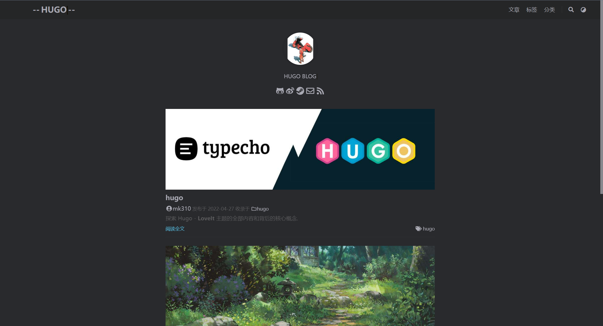

# hugo


探索 Hugo - **LoveIt** 主题的全部内容和背后的核心概念.

## hugo使用

### 1 添加行列式

>[Typora数学公式汇总（Markdown） - 知乎 (zhihu.com)](https://zhuanlan.zhihu.com/p/261750408?utm_source=wechat_session)
>
>[Supported Functions · KaTeX](https://katex.org/docs/supported.html)


<!--more-->

## 1 准备

由于 Hugo 提供的便利性, [Hugo](https://gohugo.io/) 本身是这个主题唯一的依赖.

直接安装满足你操作系统 (**Windows**, **Linux**, **macOS**) 的最新版本 [:(far fa-file-archive fa-fw): Hugo (> 0.62.0)](https://gohugo.io/getting-started/installing/).


由于 [Markdown 渲染钩子函数](https://gohugo.io/getting-started/configuration-markup#markdown-render-hooks) 在 [Hugo 圣诞节版本](https://gohugo.io/news/0.62.0-relnotes/) 中被引入, 本主题只支持高于 **0.62.0** 的 Hugo 版本.



由于这个主题的一些特性需要将 :(fab fa-sass fa-fw): SCSS 转换为 :(fab fa-css3 fa-fw): CSS, 推荐使用 Hugo **extended** 版本来获得更好的使用体验.


## 2 安装

以下步骤可帮助你初始化新网站. 如果你根本不了解 Hugo, 我们强烈建议你按照此 [快速入门文档](https://gohugo.io/getting-started/quick-start/) 进一步了解它.

### 2.1 创建你的项目

Hugo 提供了一个 `new` 命令来创建一个新的网站:

```bash
hugo new site my_website
cd my_website
```

### 2.2 安装主题

**LoveIt** 主题的仓库是: [https://github.com/dillonzq/LoveIt](https://github.com/dillonzq/LoveIt).

你可以下载主题的 [最新版本 :(far fa-file-archive fa-fw): .zip 文件](https://github.com/dillonzq/LoveIt/releases) 并且解压放到 `themes` 目录.

另外, 也可以直接把这个主题克隆到 `themes` 目录:

```bash
git clone https://github.com/dillonzq/LoveIt.git themes/LoveIt
```

或者, 初始化你的项目目录为 git 仓库, 并且把主题仓库作为你的网站目录的子模块:

```bash
git init
git submodule add https://github.com/dillonzq/LoveIt.git themes/LoveIt
```

### 2.3 基础配置 {#basic-configuration}

以下是 LoveIt 主题的基本配置:

```toml
baseURL = "http://example.org/"
# [en, zh-cn, fr, ...] 设置默认的语言
defaultContentLanguage = "zh-cn"
# 网站语言, 仅在这里 CN 大写
languageCode = "zh-CN"
# 是否包括中日韩文字
hasCJKLanguage = true
# 网站标题
title = "我的全新 Hugo 网站"

# 更改使用 Hugo 构建网站时使用的默认主题
theme = "LoveIt"

[params]
  # LoveIt 主题版本
  version = "0.2.X"

[menu]
  [[menu.main]]
    identifier = "posts"
    # 你可以在名称 (允许 HTML 格式) 之前添加其他信息, 例如图标
    pre = ""
    # 你可以在名称 (允许 HTML 格式) 之后添加其他信息, 例如图标
    post = ""
    name = "文章"
    url = "/posts/"
    # 当你将鼠标悬停在此菜单链接上时, 将显示的标题
    title = ""
    weight = 1
  [[menu.main]]
    identifier = "tags"
    pre = ""
    post = ""
    name = "标签"
    url = "/tags/"
    title = ""
    weight = 2
  [[menu.main]]
    identifier = "categories"
    pre = ""
    post = ""
    name = "分类"
    url = "/categories/"
    title = ""
    weight = 3

# Hugo 解析文档的配置
[markup]
  # 语法高亮设置 (https://gohugo.io/content-management/syntax-highlighting)
  [markup.highlight]
    # false 是必要的设置 (https://github.com/dillonzq/LoveIt/issues/158)
    noClasses = false
```


在构建网站时, 你可以使用 `--theme` 选项设置主题. 但是, 我建议你修改配置文件 (**config.toml**) 将本主题设置为默认主题.


### 2.4 创建你的第一篇文章

以下是创建第一篇文章的方法:

```bash
hugo new posts/first_post.md
```

通过添加一些示例内容并替换文件开头的标题, 你可以随意编辑文章.


默认情况下, 所有文章和页面均作为草稿创建. 如果想要渲染这些页面, 请从元数据中删除属性 `draft: true`, 设置属性 `draft: false` 或者为 `hugo` 命令添加 `-D`/`--buildDrafts` 参数.


### 2.5 在本地启动网站

使用以下命令启动网站:

```bash
hugo serve
```

去查看 `http://localhost:1313`.




当你运行 `hugo serve` 时, 当文件内容更改时, 页面会随着更改自动刷新.



由于本主题使用了 Hugo 中的 `.Scratch` 来实现一些特性,
非常建议你为 `hugo server` 命令添加 `--disableFastRender` 参数来实时预览你正在编辑的文章页面.

```bash
hugo serve --disableFastRender
```


### 2.6 构建网站

当你准备好部署你的网站时, 运行以下命令:

```bash
hugo
```

会生成一个 `public` 目录, 其中包含你网站的所有静态内容和资源. 现在可以将其部署在任何 Web 服务器上.


