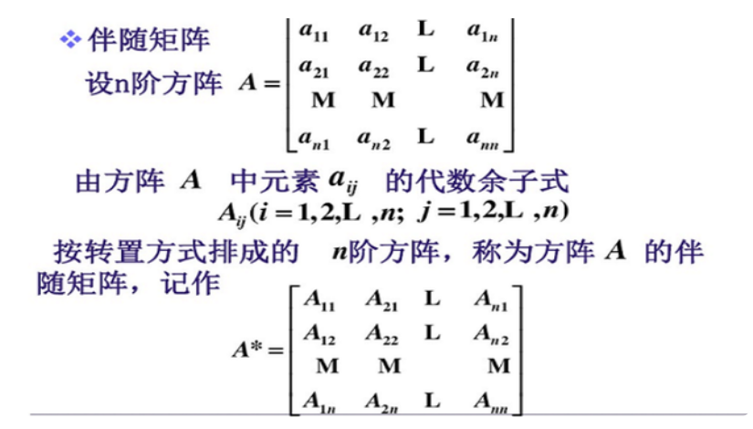
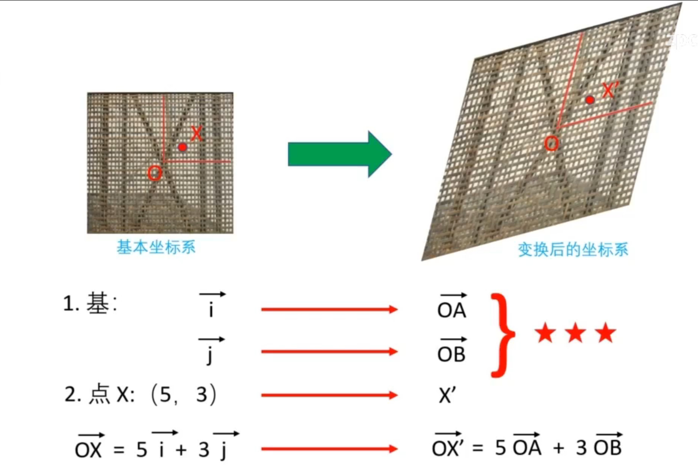

# LinearAlgebra

## 行列式

### 1-基本概念

- 逆序
- 逆序数：$ \tau(421635) = 3+1+0+2+0+0 = 6$

- 行列式:行列式本身是代数式或者值
- 余子式和代数余子式

### 2-特殊的高阶行列式对角，上下三角行列式

- 范德蒙行列式：

- 分块行列式
  - $\begin{vmatrix} A&C \\\\ 0&B \end{vmatrix} = \begin{vmatrix} A&0 \\\\ D&B \end{vmatrix} = |A| \cdot |B|$
  - 设AB分别为m，阶矩阵：$\begin{vmatrix} A&0 \\\\ 0&B \end{vmatrix} = (-1)^{mn}|A|\cdot|B|$

- 拉普拉斯

$A_{nn}B_{nn},|AB| = |A|\cdot|B|$ 

### 3-行列式的计算

#### 3-1 一般行列式转化为上下三角行列式

1. 行列式和其转置行列式相等，即$D = D^T$.

2. 对调两行（或者列）行列式变号。
3. 某行或者某列有公因子可以提取到行列式的外面。
   - 推论1 行列式某行或列全为0，行列式值为0.
   - 推论2  行列式某两行或列相等，行列式值为0.
   - 推论3 行列式某两行元素对应成比例，行列式值为0.
4. 行列式某行或者列的每个元素都是两个数之和时，行列式可分解为两个行列式之和。
5. 行列式的某行或者列的倍数加到另一行或者列，行列式不变。

#### 3-2 行列式降阶

1. 行列式等于**行或者列元素** 与其对应的**代数余子式之积的和**。

$$D = a_{i1}A_{i1}+a_{i2}A_{i2}+ \cdots +a_{in}A_{in}(i = 1,2, \cdots , n)$$

2. 行列式的某行或者列元素与另一行或列对应元素的代数余子式之积的和为0.

$$a_{i1}A_{j1}+a_{i2}A_{j2}+ \cdots +a_{in}A_{jn}(i \neq j )$$

## 矩阵



矩阵的幂矩阵求法



### 1- 基本概念

#### 1-2 同型矩阵和矩阵相等：行列数m，n相等同型，所有元素相等才相等。

#### 1-3  伴随矩阵（只有方阵才有伴随矩阵）

伴随矩阵的性质：

- $(A^{T})^* = (A^*)^{T}$
- $(kA)^* = k^{n-1}A^*$
- $(AB)^* = B^* A^*$

#### 1-4 特殊矩阵

- 零矩阵
- n阶方阵
- 单位矩阵，数量矩阵
- 转置矩阵$A^T$
- 非奇异矩阵（$|A| \ne 0$）
- 实对称矩阵（$A^T = A$）
- 正交矩阵（$A^TA = E$）
- 对角矩阵（只有对角有元素）

### 2 矩阵的运算和性质

#### 2-1 矩阵的三则运算

##### 矩阵加减：必须是同型，对应各项相加减

##### :cry:矩阵乘法（内标相同才可以运算，外标决定结果型）

矩阵和数**k**相乘：每项都乘**k**

矩阵和矩阵乘法：

 $$A_{mn} \times B_{ns}  = R_{ms} $$ 



$$
\begin{gathered}
\overrightarrow {OA}  = a_{x} \overrightarrow{i} +a_{y} \overrightarrow{j} \\\\ \overrightarrow {OB}  = b_{x} \overrightarrow{i} +b_{y} \overrightarrow{j}  \end{gathered} \qquad\Rightarrow\qquad \begin{gathered}
\overrightarrow {OX^{'}}  = 5(a_{x} \overrightarrow{i} +a_{y} \overrightarrow{j})+3( b_{x} \overrightarrow{i} +b_{y} \overrightarrow{j} ) \end{gathered}
$$

$$
\begin{gathered}
\overrightarrow {OA} = \begin{bmatrix}a_x \\\\ a_y \end{bmatrix}  \\\\
\overrightarrow{OB} = \begin{bmatrix}b_x \\\\ b_y \end{bmatrix} 
\end{gathered} 
\qquad\Rightarrow\qquad 
\begin{gathered}
\overrightarrow {OX^{'}}  = 5\begin{bmatrix}a_x \\\\ 
a_y \end{bmatrix}+3\begin{bmatrix}b_x \\\\ b_y \end{bmatrix}
=(5,3)\begin{bmatrix} a_x&b_x \\\\ a_y&b_y \end{bmatrix}
\end{gathered}
$$

$$
\quad \quad 
\begin{matrix}
{\overrightarrow a_{1}}\over{\uparrow}&{\overrightarrow a_{2}}\over{\uparrow}&\cdots&{\overrightarrow a_{n}}\over{\uparrow} 
\end{matrix}
\quad \quad
\begin{matrix}
\quad
\end{matrix}\\\
\quad \quad A = 
\begin{bmatrix}
 {a_{11}}&a_{12}&\cdots&a_{1n} \\\\
a_{21}&a_{22}&\cdots&a_{2n} \\\\
\vdots&\vdots&&\vdots		\\\\
a_{m1}&a_{m2}&\cdots&a_{mn} 
\end{bmatrix},
x = 
\begin{bmatrix}
x_{1} \\\\
x_{2} \\\\
\vdots		\\\\
x_{1}
\end{bmatrix},
$$

矩阵相乘的**本质**：

标准坐标系中的点经过矩阵A的变换后，变为以矩阵**A的列向量为基**的坐标系中的点x。Ax就是变换后坐标系中点x的坐标。



理解:每行分别和每一列相乘



notes：

  $$AA^* = |A|E$$ 

#### 2-2 矩阵的转置 

定义 ：A的转置即A的第一行变为$A^T$的第一列

性质：

- $(A \pm B)^T = A^T \pm B^T$
- $(AB)^T = B^T A^T$
- $(A^{-1})^T = (A^T)^{-1}$
- $(A^{m})^T = (A^m)^{T}$
- $(A^{T})^T = A$
- $(kA)^T = kA^T$

### 3 矩阵的逆矩阵

逆矩阵产生的背景：方程的解

#### 3-1 逆矩阵的定义

若存在n阶矩阵B使$BA = E$，称A可逆，B为A的逆矩阵，记为  $B = A^{-1}$ 

- 矩阵可逆的条件

- 如何求逆矩阵

#### 3-2 矩阵可逆的充分必要条件   :star:

定理：设A是n阶矩阵，则A可逆的充分必要条件时$|A|\ne 0$ 

**证明**:smile:(会证明)

- 充分性：$BA = E 得 |BA| = |B||A| = E \ne 0$ 所以$|A| \ne 0$ 
- 必要性：$A^{-1} =\frac { 1}{|A|}A^*$  只要$|A| \ne 0，A^*存在$

#### 3-3 逆矩阵的求法

##### 1 伴随矩阵求法（阶数不超过三阶）

若矩阵A可逆，则$A^{-1} =\frac { 1}{|A|}A^*$

##### 2 初等变换法

> 方程组中的一方程对应矩阵$\overline A$(增广矩阵)中的一行。
>
> *（单纯解解方程不能列变换）*
>
> 若$|A| \ne 0$,则求解方程的过程即将系数矩阵A化为单位矩阵E的过程。 

###### 初等行变换（对应的还有初等列变换）

1. 对调两个矩阵的两行

​	$E_{i,j}$	(矩阵的i,j两行交换位置) 

2. 矩阵的某行乘以非零常数$k$

​	$E_{i}(c)$	(将矩阵的第i行乘以c得到的矩阵)

3. 矩阵某行的倍数加到另一行

​	$E_{i,j}(k)$	(将矩阵的第i行的k倍加到第j行)

4. 初等矩阵的性质
   - $|E_{i,j}| = -1$ 	$|E_{i}(c)| = c $	$|E_{i,j}(k)| = 1 $  三个初等矩阵都可逆
   - $(E_{i,j})^{-1} = E_{i,j}$
   - $[E_{i}(c)]^{-1} = E_{i}(\frac{1}{c}) $
   - $[E_{i,j}(k)]^{-1} = E_{i,j}(-k) $

​	**问：$A$ 是否可以经过有限次初等行变换/列变换/变换转换为单位矩阵$E$**

###### 初等变换求逆矩阵

- 定理1：A是n阶可逆矩阵，$(A\vdots E) \stackrel{行}\rightarrow (E\vdots A^{-1})$
- 定理2：A是n阶可逆矩阵，B为n行s列矩阵，$(A\vdots B) \stackrel{行}\rightarrow (E\vdots A^{-1} B)$
- 定理3：
- 定理4：

#### 3-4 逆矩阵的性质

1. $(A^{-1})^{-1} = A$

2. $(kA)^{-1} = \frac{1}{k}A^{-1}$

3. $(AB)^{-1} = B^{-1}A^{-1}$

4. $(A^T)^{-1} = (A^{-1})^T$

5. $(A^n)^{-1} = (A^{-1})^n$

6. $$
   \begin{pmatrix} A & O \\\\ O & B \end{pmatrix}^{-1} = \begin{pmatrix} A^{-1} & O \\\\ O & B^{-1} \end{pmatrix} 
   $$

   $$
   \begin{pmatrix} O & A \\\\ B & A \end{pmatrix}^{-1} = \begin{pmatrix} O & A^{-1} \\\\ B^{-1} &O  \end{pmatrix}
   $$

### 4 矩阵的秩

#### 4-1 矩阵秩的概念

#### 4-2 矩阵秩的求法

在方程组中，矩阵的秩的本质是方程组中约束条件的个数，二方程组的约束条件的个数即经过方程组单中同解（初等变换）变形***阶梯化***后留下的方程组的个数，因此对矩阵进行初等行变换阶梯化后非零行数即为矩阵的秩：
$$
A  = \begin{pmatrix} 1 & 1&-1&3 \\\\ 1&2&1& 1 \\\\ 2&3&0&4 \end{pmatrix} \rightarrow 
\begin{pmatrix} 1 & 1&-1&3 \\\\ 0&1&2&-2 \\\\ 0&1&2&-2 \end{pmatrix}  \rightarrow
\begin{pmatrix} 1 & 1&-1&3 \\\\ 0&1&2&-2 \\\\ 0&0&0&0 \end{pmatrix}
$$
即$r(A) = 2$

#### 4-3 矩阵秩的性质

1. $r(A) = r(A^T) = r(A^TA) = r(AA^T)$ 【:point_right:出现$ A^TA , AA^T$时使用】[^1]

2. $r(A \pm B) \leq r(A)+r(B)$  【:point_right: 题中出现$A \pm B$ 或者 $r(A)+r(B)$时】

3. $A,B分别为m \times n ，n \times s 矩阵，r(AB) \leq min [ r(A),r(B) ]$,矩阵相乘秩不会增长【:point_right:看到AB时候使用】

4. :star:$A,B分别为m \times n ，n \times s 矩阵,AB = 0,则r(A)+r(B) \leq n$【:point_right:看到$AB = 0$】

5. A 是$m \times n$矩阵，P，Q分别为m,n阶可逆矩阵，  $r(A) = r(PA) = r(AQ) = r(PAQ)$

6. :star:设A是n阶矩阵，则
   $$
   r(A^*) = \begin{cases} n,r(A) = n, \\\\ 1,r(A) = n-1,(n \geq 2) \\\\ 0,r(A)<n-1 \end{cases}
   $$
   
7. (1)$若A，B分别为m \times s ,n \times s$矩阵，则

$$
max [ r(A),r(B) ] \leq r{\begin{pmatrix} A \\\\B \end{pmatrix}} \leq r(A) +r(B)
$$

$若A，B分别为m \times n,m \times s$矩阵，则
$$
max [r(A),r(B)] \leq r(A \vdots B) \leq r(A) +r(B)
$$
(2) $r{ \begin{pmatrix} A&O \\\\ O&B \end{pmatrix}} = r(A) +r(B)$

8. 设A为n阶非零矩阵，则r(A) = 1的充分必要条件是，存在非零向量 $\alpha ,\beta,使得A= \alpha \beta^T$

   

### 5 矩阵等价

#### 5-1 矩阵等价的定义

设**A**和**B**为同型的矩阵，**A**经过有限次的初等变换变为**B**，则称A，B等价。

#### 5-2 矩阵等价的判别方法

- **定理一**：设**A**和**B**为同型的矩阵，**A**，**B**等价的充分必要条件是$r(A) = r(B)$
- **定理二**:  设**A**和**B**为同型的矩阵，**A**，**B**等价的充分必要条件是,存在可逆矩阵$P,Q$,使得$PAQ = B$

## 向量

### 1 向量的概念和运算

#### 1-1 基本概念

- 向量：既有大小又有方向的量

- 向量的模：$\alpha = \begin{bmatrix}a_1 \\\\ a_2 \\\\ \vdots \\\\a_n\end{bmatrix},向量的模 ：\sqrt{{a_1}^2+{a_2}^2+\cdots+{a_2}^2}$

- 向量的单位化：单位向量 ：${\alpha}^0 = \frac{1}{|\alpha|}\alpha$

- 向量的三则运算

- 向量的内积：
  $$
  \alpha = 
  \begin{bmatrix}
  a_1 \\\\ a_2 \\\\ \vdots \\\\a_n
  \end{bmatrix}
  ,
  \beta =
  \begin{bmatrix}
  b_1 \\\\ b_2 \\\\ \vdots \\\\b_n
  \end{bmatrix}
  ,
  内积(\alpha,\beta) = a_1b_1+a_2b_2+\cdots+a_nb_n
  $$
  

#### 1-2 向量运算的性质

- 三则运算支持交换律，结合律
- 向量内积性质：
  - $（\alpha,k_1\beta_1+k_2\beta_2+\cdots+k_n\beta_n） = k_1(\alpha_1,\beta_1)+k_2(\alpha_2,\beta_2)+\cdots+k_n(\alpha_n,\beta_n)$
  - $(\alpha,\beta) =0 \Leftrightarrow a_1b_1+a_2b_2+\cdots+a_nb_n = 0 称 \alpha ,\beta正交，记作\alpha \perp \beta  $

### 2 向量组的相关性与线性表示

#### 2-1 向量的相关性和线性表示理论的背景

向量的相关性与线性表示理论本质上是以向量为工具对方程组理论进行描述：每一个向量表示系数矩阵的一列。

#### 2-2 向量组相关性与线性表示的基本概念

##### 2-2-1 相关性

对齐次线性方程组

$$
x_1\alpha_1+x_2\alpha_2 +\cdots +x_n\alpha_n \\\\
$$

#### 2-3 向量组相关性与线性表示的性质

### 3 向量组等价，向量组的极大线性无关组与向量组的秩

#### 3-1 基本概念

#### 3-2 向量组秩的性质

[^1]:[(如何证明矩阵A乘以A的转置的秩＝A的秩？ - 知乎 (zhihu.com)](https://www.zhihu.com/question/498418851/answer/2220779021)

