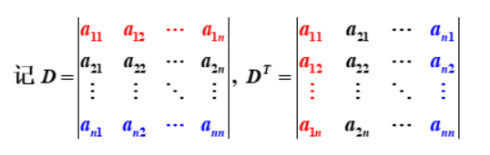

# LinearAlgebra

## 行列式

### 1-基本概念

- 逆序
- 逆序数
- 行列式：代数式或者值
- 余子式和代数余子式

### 2-特殊的高阶行列式

- 对角，上下三角行列式

- 范德蒙行列式：

- 分块行列式
- 拉普拉斯

### 3-行列式的计算

#### 3-1 一般行列式转化为上下三角行列式

1. 行列式和其转置行列式相等，即$D = D^T$.

2. 对调两行（或者列）行列式变号。
3. 某行或者某列有公因子可以提取到行列式的外面。
   - 推论1 行列式某行或列全为0，行列式值为0.
   - 推论2  行列式某两行或列相等，行列式值为0.
   - 推论3 行列式某两行元素对应成比例，行列式值为0.
4. 行列式某行或者列的每个元素都是两个数之和时，行列式可分解为两个行列式之和。
5. 行列式的某行或者列的倍数加到另一行或者列，行列式不变。

#### 3-2 行列式降阶

1. 行列式等于**行或者列元素** 与其对应的**代数余子式之积的和**。

$$D = a_{i1}A_{i1}+a_{i2}A_{i2}+ \cdots +a_{in}A_{in}(i = 1,2, \cdots , n)$$

2. 行列式的某行或者列元素与另一行或列对应元素的代数余子式之积的和为0.

$$a_{i1}A_{j1}+a_{i2}A_{j2}+ \cdots +a_{in}A_{jn}(i \neq j )$$

