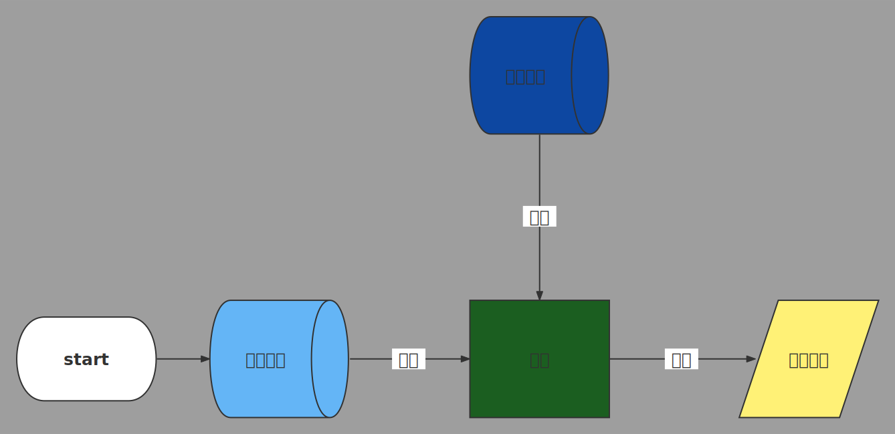
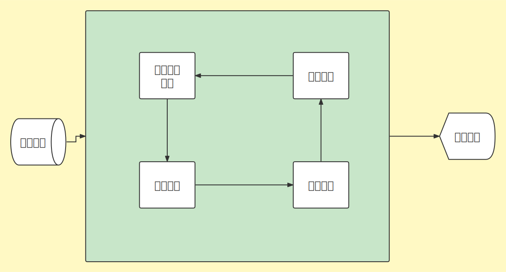
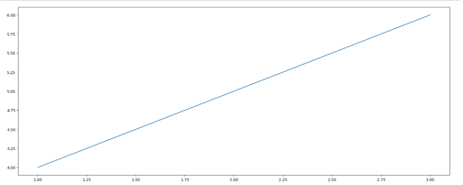
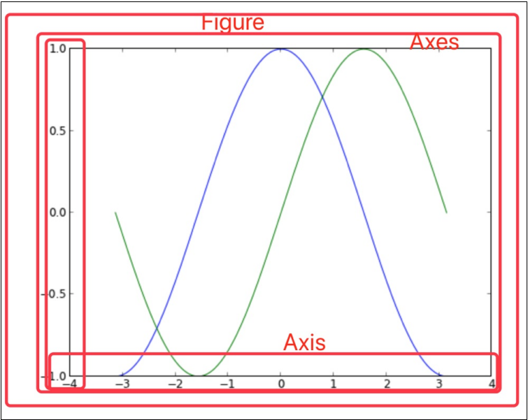
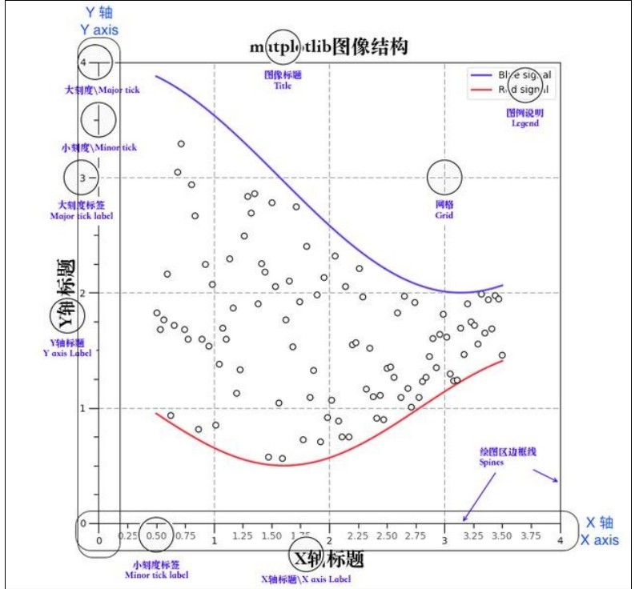
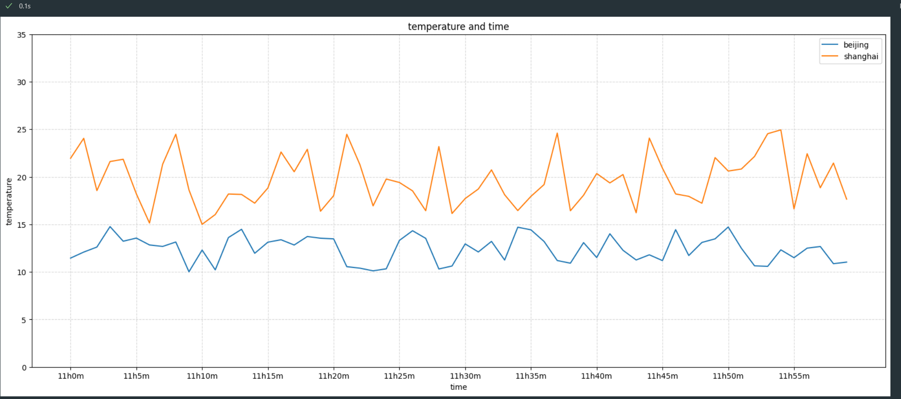
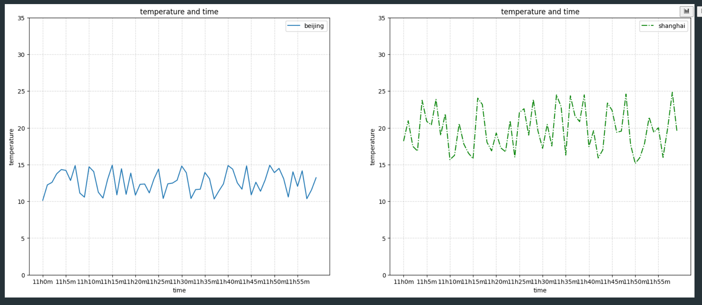

# 机器学习


## 1-绪论

### 三个关系

- artificial intelligence
  - machine learning  人工智能的一个实现途径
    - deepinglearing  深度学习的神经网络 方法发展而来

### 分支

- 计算机视觉
- 自然语言处理
  - 语音识别
    - 困难：鸡尾酒会效应：不能处理多人交流

  - 文本挖掘/分类
  - 机器翻译

- 机器人

### 人工智能三要素

- 数据
- 算法
- 计算力

## 2-机器学习的工作流程

### 定义



- 数据
- 数据基本处理
- 特征工程
- 机器学习（模型训练）
- 模型评估



### 2-1获取数据集

| 电影名称        | 打斗镜头 | 接吻镜头 | 电影类型 |
| --------------- | -------- | -------- | -------- |
| beautiful woman | 1        | 80       | 爱情片   |
| kill bill       | 200      | 5        | 动作片   |

- 一行数据称为一个样本
- 一列数据称为一个特征
- 有些数据有目标值，有些则没有，上表中电影 类型就是目标值

数据类型构成：

- 类1 特征值+目标值  （目标值是连续或者离散的：电影的类型是连续的）
- 类2 只有特征值没有目标值

数据分割：

- 训练数据：用于训练，**构建模型**
- 测试数据：**模型评估**时使用

### 2-2数据基本处理

对数据进行缺失值，去除异常值等处理

### 2-3特征工程


- 特征提取：将任意数据转化为机器学习可处理的数字特征

- 特征预处理：用一些转换函数将特征数据转换为更加适合**算法模型**的特征数据

- 特征降维：在某些限定条件下，降低随机变量（特征）个数，得到一组不相关的住变量（由地球仪变地图）

### 2-4 机器学习 

选择合适的算法对模型进行训练

### 2-5 模型评估

对训练号的模型进行评估

## 3算法分类

### 3-1监督学习

定义：输入数据是有输入特征值和目标值狗的构成。

- 若函数的输出为连续的值：称为**回归**
- 若函数的输出为有限个离散的值：称为**分类**

回归问题


{
  "title": {
    "text": "折线统计图",
    "top": "2%",
    "left": "center"
  },
  "tooltip": {
    "trigger": "axis"
  },
  "legend": {
    "data": ["邮件营销", "联盟广告", "视频广告", "直接访问", "搜索引擎"],
    "top": "10%"
  },
  "grid": {
    "left": "5%",
    "right": "5%",
    "bottom": "5%",
    "top": "20%",
    "containLabel": true
  },
  "toolbox": {
    "feature": {
      "saveAsImage": {
        "title": "保存为图片"
      }
    }
  },
  "xAxis": {
    "type": "category",
    "boundaryGap": false,
    "data": ["周一", "周二", "周三", "周四", "周五", "周六", "周日"]
  },
  "yAxis": {
    "type": "value"
  },
  "series": [
    {
      "name": "邮件营销",
      "type": "line",
      "stack": "总量",
      "data": [120, 132, 101, 134, 90, 230, 210]
    },
    {
      "name": "联盟广告",
      "type": "line",
      "stack": "总量",
      "data": [220, 182, 191, 234, 290, 330, 310]
    },
    {
      "name": "视频广告",
      "type": "line",
      "stack": "总量",
      "data": [150, 232, 201, 154, 190, 330, 410]
    },
    {
      "name": "直接访问",
      "type": "line",
      "stack": "总量",
      "data": [320, 332, 301, 334, 390, 330, 320]
    },
    {
      "name": "搜索引擎",
      "type": "line",
      "stack": "总量",
      "data": [820, 932, 901, 934, 1290, 1330, 1320]
    }
  ]
}


离散问题


{
   "xAxis": {},
  "yAxis": {},
  "series": [
    {
      "symbolSize": 20,
      "data":[
        [0, 5],
        [2, 4],
        [1, 3],
        [6, 4],
        [4, 1], 
        [2, 1], 
        [3, 5], 
        [5, 3], 
        [2, 2], 
        [5, 5], 
        [6, 1], 
        [2, 1], 
        [0, 4], 
        [4, 1], 
        [0, 1], 
        [2, 1], 
        [1, 4], 
        [1, 1], 
        [3, 3], 
        [4, 2], 
        [6, 2]
      ],
      "type": "scatter"
    },
    {
      "symbolSize": 20,
      "data":[
[8, 10], [13, 8], [8, 9], [14, 5], [8, 6], [12, 8], [13, 5], [13, 8], [9, 8], [11, 9], [15, 7], [13, 6], [8, 6], [9, 5], [14, 5]
      ],
      "type": "scatter"
    }
  ]
}



### 3-2无监督学习

仅有特征值而无目标值

### 3-3半监督学习

> reference:[([半监督学习_百度百科 (baidu.com)](https://baike.baidu.com/item/半监督学习/9075473?fr=aladdin))

有特征值，有目标值，但是部分数据没有目标值

### 3-4 强化学习

强化学习世界是做决定（make decissions）问题，即自动进行决策，并且可以连续决策。

例子：孩子学走路。

孩子就是agent，通过采取action（走路）来操纵environment（行走的表面），并且从**一个状态转变为另一个状态**（走的每一步），当他完成任务的子任务（走了几步）时，会得到reward，当他不能走路时，没有reward。


flowchart RL
a[Environment] --> |reward| b[Agent]
a -->|observation| b
b --> |action| a


## 4模型评估

### 4-1 分类模型评估

- 准确率
- 精确率
- 召回率
- f1-score
- auc指标

### 4-2回归模型评估

- 均方根误差（Root Mean Squared Error,RMSE）

  - RMSE是一个衡量回归模型误差率的常用公式，仅能比较误差是相同单位的模型。

    $$RESM =  \sqrt \frac{\sum_{i = 1} ^{n}{\left( {p_{i}-a_{i}} \right) ^2}}{n}$$


​			a = actual target

​			p = perdected target

- 相对平方误差（Relative Squared Error,RSE）

  - 和RMSE不同，RSE可以比较误差不是相同单位的模型。

    $$RSE =  \frac{\sum_{i = 1} ^{n}{({p_{i}-a_{i}})^2}}{\sum_{i = 1} ^{n}{({\overline{a}-a_{i}})^2}}$$

- 平均绝对值误差（Mean Absolute Error,MAE）

  - MAE与原始数据单位相同，它仅能比较单位相同的模型，量级和RMSE相似，但是误差值相对小一点。

  $$MAE =  \frac{\sum_{i = 1} ^{n}{\rvert p_{i}-a_{i}\rvert}}{n}$$

- 相对绝对误差（Relative Absolute Error,RAE）

  - 与RSE不同，RAE可以比较误差是不同单位的模型。

    $$RAE = \frac{\sum_{i = 1} ^{n}{\rvert p_{i}-a_{i}\rvert}}{\sum_{i = 1} ^{n}{\rvert \overline {a}-a_{i}\rvert}}$$

- 决定系数（Coefficent of Determination）

  - 决定系数（**$R^2$**）回归模型汇总了回归模型的解释度，由平方和术语计算而得。

    $$R^2= 1 -  \frac{\sum_{i = 1} ^{n}{({p_{i}-a_{i}})^2}}{\sum_{i = 1} ^{n}{({\overline{a}-a_{i}})^2}}$$

  -  **$R^2$** 描述了回归模型所解释的因变量方差在总方差中的比例，$R^2$很大，即自变量和因变量之间存在线性关系，如果回归模型是完美的，SSE（分数上部分）为0.则$R^2$为1.$R^2$小，则自变量因变量之间存在线性关系的证据不足，回归模型失败SSE等于SST（上下相等），没有方差可被回归解释，$R^2$为0.

​	

### 4-3拟合

#### 欠拟合

因为机器学习到的数据特征太少，导致区分标准太粗糙。

#### 过拟合

模型表现过于优越，导致验证数据集即测试数据集中表现不佳。eg：识别天鹅时，因为黑天鹅不是白色的判断不是天鹅。

## 实战

### 1 环境安装和基础配置

python创建虚拟环境（windows环境下）
> https://www.jb51.net/article/214307.htm

这里所指的环境包括：
- python解释器，选用哪个解释器执行代码
- python库的位置，去哪里引用所需的模块
- 可执行文件的位置，例如pip文件在哪里

由于每个项目的情况都可能不一样，比如这个项目用的是vtk 7.1，另一个项目用的是vtk 9.0。如果不进行环境隔离而是全局安装，就会导致包的冲突从而出现问题，这个时候让每个项目都拥有一套独立的Python环境，这样就不会产生冲突了。Python虚拟环境正是为了解决这个问题而存在的，简而言之，虚拟环境就是系统 Python 环境的一个副本。

安装virtualenv
```bash
pip install virtualenv
```

创建一个独立的python运行环境 

```bash
virtualenv  ai 
//no--site--packages 表示不复制已经安装到系统python环境中的所有第三方包，得到一个纯净的环境，20版本以上默认
```

激活运行环境

```bash
ai\Scripts\activate
//退出当前的环境
deactivate
```

激活环境后命令提示符的前面会显示虚拟环境名

安装特定版本的库文件

```
//matplotlib安装
pip install matplotlib
// numpy 安装(实际上面的安装已经安装)
// 安装pandas
// 安装 tables
// 安装jupyter
```

### 2 jupyter notebook使用

juputer开源软件，ipython的加强版

> [tensorflow教程一：安装和jupyter notebook的使用 - 哔哩哔哩 (bilibili.com)](https://www.bilibili.com/read/cv3704251)

### 3 matplotlib 使用

绘图库

#### 3-1 实现简单的绘图

```python
import matplotlib.pyplot as plt # 1.创建画布 
plt.figure(figsize=(20,8), dpi=100) # 2.绘制图像 
x = [1,2,3] y = [4,5,6] 
plt.plot(x, y) # 3.显示图像 
plt.show()
```



#### 3-2 matplotlib三层显示

- 容器层

​		容器层主要由Canvas、Figure、Axes组成。

- Canvas是位于最底层的系统层，在绘图的过程中充当画板的⻆⾊，即放置画布(Figure)的⼯具。

- Figure是Canvas上⽅的第⼀层，也是需要⽤户来操作的应⽤层的第⼀层，在绘图的过程中充	当画布的⻆⾊。 

- Axes是应⽤层的第⼆层，在绘图的过程中相当于画布上的绘图区的⻆⾊。


  - Figure:指整个图形(可以通过plt.figure()设置画布的⼤⼩和分辨率等)
  - Axes(**坐标系**):数据的绘图区域
  - Axis(**坐标轴**)：坐标系中的⼀条轴，包含⼤⼩限制、刻度和刻度标签 
  - ⼀个figure(图像)可以包含多个axes(坐标系/绘图区)，但是⼀个axes只能属于⼀个figure。 
  - 一个axes(坐标系/绘图区)可以包含多个axis(坐标轴)，包含两个即为2d坐标系，3个即为3d坐标系 

  

- 辅助显示层

​	辅助显示层为Axes(绘图区)内的除了根据数据绘制出的图像以外的内容，主要包括Axes外观(facecolor)、边框线 (spines)、坐标轴(axis)、坐标轴名称(axis label)、坐标轴刻度(tick)、坐标轴刻度标签(tick abel)、⽹格线(grid)、图例 (legend)、标题(title)等内容。该层的设置可使图像显示更加直观更加容易被⽤户理解，但⼜不会对图像产⽣实质的影响。 

- 图像层

​	图像层指Axes内通过plot、scatter、bar、histogram、pie等函数根据数据绘制出的图像。



- 总结
  - Canvas（画板）位于最底层，⽤户⼀般接触不到 
  - Figure（画布）建⽴在Canvas之上 
  - Axes（绘图区）建⽴在Figure之上 
  - 坐标轴（axis）、图例（egend）等辅助显示层以及图像层都是建⽴在Axes之上 

#### 3-3 matplotlib 图例

基本图例：显示温度变化情况

```python
import matplotlib.pyplot as plt
import random

# 生成数据
x = range(60)
y_beijing = [random.uniform(10,15) for i in x]
y_shanghai = [random.uniform(15,25) for i in x]

# 1创建画布
plt.figure(figsize  = (20,8),dpi = 100)

# 2 图形绘制
plt.plot(x,y_beijing,label= 'beijing')
plt.plot(x,y_shanghai,label = 'shanghai')

plt.yticks(y_ticks[::5])
plt.xticks(x[::5], x_ticks_label[::5])

# 2.1 添加刻度
y_ticks = range(40)
x_ticks_label = ["11h{}m".format(i) for i in x]

# 2.2添加网格
plt.grid(True,linestyle = '--',alpha = 0.5)

# 2.3添加描述
plt.xlabel('time')
plt.ylabel('temperature')
plt.title('temperature and time')

# 2.4 显示图例
plt.legend()

# 3 图像显示
plt.show()
```



特殊图例：多坐标系显示温度变化

```python 
import matplotlib.pyplot as plt
import random

# 生成数据
x = range(60)
y_beijing = [random.uniform(10,15) for i in x]
y_shanghai = [random.uniform(15,25) for i in x]

# 1创建画布
# plt.figure(figsize  = (20,8),dpi = 100)
fig, axes = plt.subplots(nrows =1,ncols = 2,figsize = (20,8),dpi = 100)

# 2 图形绘制
axes[0].plot(x,y_beijing,label= 'beijing')
axes[1].plot(x,y_shanghai,label = 'shanghai',color = 'g',linestyle = '-.')


# 2.1 添加刻度
y_ticks = range(40)
x_ticks_label = ["11h{}m".format(i) for i in x]

axes[0].set_xticks(x[::5])
axes[0].set_yticks(y_ticks[::5])
axes[0].set_xticklabels(x_ticks_label[::5])

axes[1].set_xticks(x[::5])
axes[1].set_yticks(y_ticks[::5])
axes[1].set_xticklabels(x_ticks_label[::5])
# 2.2添加网格
axes[0].grid(True,linestyle = '--',alpha = 0.5)
axes[1].grid(True,linestyle = '--',alpha = 0.5)

# 2.3添加描述
axes[0].set_xlabel('time')
axes[0].set_ylabel('temperature')
axes[0].set_title('temperature and time')

axes[1].set_xlabel('time')
axes[1].set_ylabel('temperature')
axes[1].set_title('temperature and time')
# 2.4 显示图例
axes[0].legend()
axes[1].legend()
# 3 图像显示
plt.show()
```



#### 3-4 折线图的应用场景

- 表示数据趋势

  - 呈现公司产品(不同区域)每天活跃⽤户数 

  - 呈现app每天下载数量 

  - 呈现产品新功能上线后,⽤户点击次数随时间的变化 

- 拓展：**画各种数学函数图像** 

